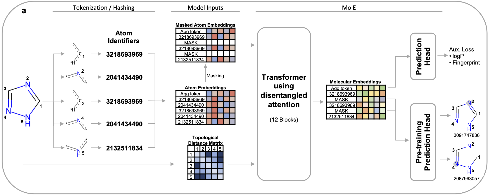

# MolE - Molecular Embeddings

<!-- TABLE OF CONTENTS -->
<details open="open">
  <summary>Table of Contents</summary>
  <ol>
    <li><a href="#about-the-project">About The Project</a></li>
    <li>
      <a href="#getting-started">Getting Started</a>
      <ul>
        <li><a href="#installation">Installation</a></li>
        <li><a href="#download-pretrained-models">Download pretrained models</a></li>
      </ul>
    </li>
    <li>
      <a href="#usage">Usage</a>
      <ul>
        <li><a href="#how-to-train-a-model">How to train a model?</a></li>
        <li><a href="#how-to-predict-properties-of-new-molecules">How to predict properties of new molecules?</a></li>
        <li><a href="#how-to-compute-embeddings-for-molecules">How to compute embeddings for molecules?</a></li>
      </ul>
    </li>
    <li><a href="#license">License</a></li>
  </ol>
</details>

<!-- ABOUT THE PROJECT -->
## About The Project

MolE is Recursion's foundation model for chemistry wihch combines geometric deep learning with
transformers, an architecture commonly used to train Large Language Models (LLMs), to learn a meaningful
representation of molecules. MolE was designed to mitigate the challenge of accurately predicting
chemical properties from small public or private datasets. MolE leverages extensive labeled and unlabeled
datasets in two pretraining steps. First it follows a novel self-supervised strategy using the graph
representation of ~842 million molecules designed to properly learn to represent chemical structures.
It is followed by a massive multi-task training to assimilate biological information.





<!-- GETTING STARTED -->
## Getting started

### Installation

If you want to install MolE in your local environment follow these steps:

First, create and activate your virtual environment:

```bash
# create a new virtual environment using pyenv
pyenv virtualenv mole

# activate the environment
pyenv activate mole
```

Next, clone this repo and move into it:

```bash
git clone https://github.com/recursionpharma/mole_public.git
cd mole_public
```

Proceed to install project dependencies, this should take less than 30 mins in a normal CPU:

```bash
# For Mac or CPU only:
pip install -r requirements/main_<PYTHON_VERSION>.txt

# For CUDA:
pip install -r requirements/main_<PYTHON_VERSION>_gpu.txt

```
where `<PYTHON_VERSION>` could be `3.9` or `3.10`

Finally, install `mole` which should take few minutes:

```bash
pip install -e .
```

**NOTE**: If you are a mac user consider to use `PYTORCH_ENABLE_MPS_FALLBACK=1` as environmental variable to avoid issues between `torch` and M1 processors. You can do it by typing:

```bash
echo "export PYTORCH_ENABLE_MPS_FALLBACK=1" >> .bashrc
```

### Download pretrained models
TODO


<!-- Usage -->
## Usage

### How to train a model?

Models can be easily trained usign `mole_train` from the command line. `mole_train` is powered by [hydra](https://hydra.cc/docs/intro/) which allows to create a  configuration file and start the job .

You can always see the complete configuration file begore launching the job by adding `--cfg job --resolve` at the end of the command. This will print the configuration file.

### Fine tune MolE
If you need to fine tune MolE using a smaller dataset (e.g. to predict activity in an internal project) you can do it  using `mole_train model=finetune` where you need to specify:

- *data_file* [string] - this is the path to the file containing the training set in your local computer.
- *checkpoint_path* [string] - this is the path to the file containing the pretrained model. If `null`, training will start from a randomly initialized model
- *dropout* [float] - specifies the dropout used in the prediction head. This should be a value between 0 and 1.
- *lr* [float] - sets the learning rate used during tratinig. Take into account that we used a linear warmup at the beginnig of the triaining.

Optionally you can also add information regarding:

- *task* [string] - this specifies if the task is a `regression` or `classification` problem. *Default: regression*
- *num_tasks* [int] - Number of tasks used. This should be same as the number of property columns in the file containing your training set. *Default: 1*

**Example:**

```bash
# Regression Example
mole_train model=finetune  data_file='data/TDC_Half_Life_Obach_train_seed0.parquet' checkpoint_path=null dropout=0.1 lr=1.0e-06 task=regression num_tasks=1 model.name='MolE_Finetune_Regression' model.hyperparameters.datamodule.validation_data='data/TDC_Half_Life_Obach_valid_seed0.parquet'

# Classification Example
mole_train model=finetune  data_file='data/TDC_HIA_Hou_train_seed0.csv' checkpoint_path=null dropout=0.1 lr=1.0e-06 task=classification num_tasks=1 model.name='MolE_Finetune_Classification' model.hyperparameters.datamodule.validation_data='data/TDC_HIA_Hou_valid_seed0.csv'
```

Training data should be a csv file containing at least a column named **smiles** and at least one property used for training

| smiles    | Property1 | Property2 |
| :---:     | :---:     | :---:     |
| CCC       | 301       | 283       |
| c1ccccc1  | 192       | 327       |


### How to predict properties of new molecules?

Once you have trained a model you can use it to predict properties of new molecules in the following way.

#### From a python shell or jupyter notebook
```bash
from mole import mole_predict
import pandas as pd

smiles= ['CCC', 'CCCCCC', 'CC', 'CCCCC']  # list of smiles

predictions = mole_predict.predict(smiles=smiles, task='regression', num_tasks=1, pretrained_model=<PATH_TO_CHECKPOINT>, batch_size=32, num_workers=4)

df = pd.DataFrame(predictions)
df.insert (0, 'smiles', smiles)
df.head()
```
#### From command line

```bash
mole_predict --smiles "CCC c1ccccc1" --task regression --num_tasks 2 --pretrained_model <path to checkpoint>
```

TO DO: predcit from smiles directly from a file

### How to compute embeddings for molecules?

You can also compute embeddings of molecules using a pre-trained MolE model. These embeddings can be used as molecular fingerprints for model training or similarity search.

#### From a python shell or jupyter notebook
```bash
from mole import mole_predict


smiles= ['CCC', 'CCCCCC', 'CC', 'CCCCC']  # list of smiles

embeddings = mole_predict.encode(smiles=smiles, pretrained_model=<PATH_TO_CHECKPOINT>, batch_size=32, num_workers=4)
embeddings.shape
```

<!-- LICENSE -->
## License

Distributed under the Attribution-NonCommercial 4.0 International License (CC-BY-NC 4.0). See `LICENSE` for more information.
